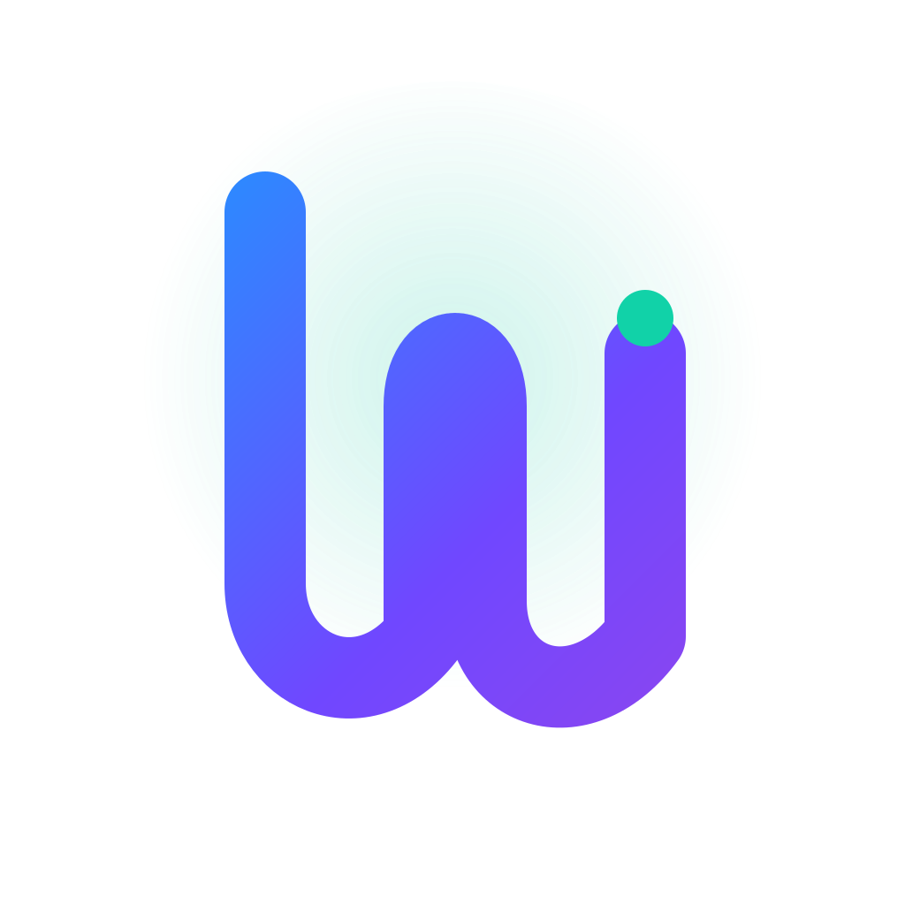

# Mu (µ)

  
   
  <strong>minimal • expressive • self-hostable</strong>

**This GitHub repo is a documentation mirror.**
The source-of-truth repository (including all implementation code) lives at `https://git.mills.io/prologic/mu`.

Mu (µ) is a minimal, dynamically-typed programming language with a small, self-hostable core. It emphasizes clarity, explicitness, and predictable semantics while remaining small enough to understand end-to-end.

## Why this repo exists

This branch is intentionally **docs-only** to keep GitHub as a social presence for the project without exposing source code here. It contains:

- Tailored README, contributing guidance, and license note.
- A curated selection of user-facing documentation.
- A handful of example programs to get a feel for Mu.

If you want the compiler, VM, REPL, or any source code, head to `https://git.mills.io/prologic/mu`.

## Start here

- `docs/GettingStarted.md` for a quick tour.
- `docs/Specification.md` for the language reference.
- `docs/Grammar.md` for the EBNF grammar.
- `docs/Roadmap.md` for the self-hosting plan.
- `examples/` for runnable sample programs.

## Contributing

Please file issues and pull requests against the source-of-truth repository on `https://git.mills.io/prologic/mu`.
`git.mills.io` supports GitHub auth, so you can sign in with your GitHub account there.

See `CONTRIBUTING.md` for details.

## License

See `LICENSE`.
